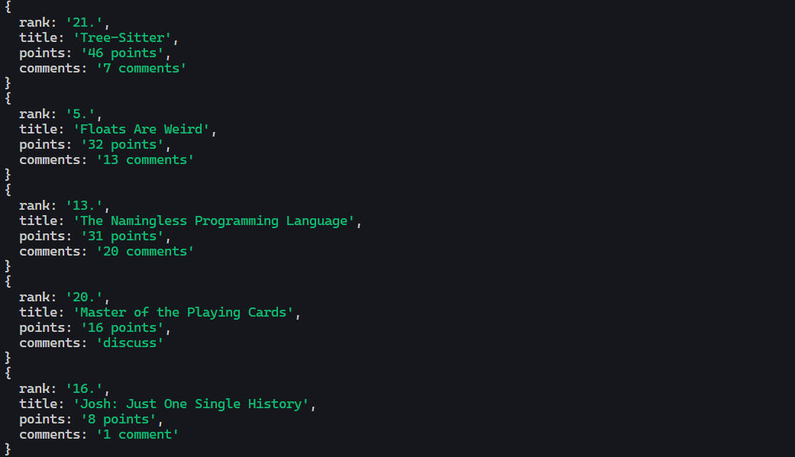
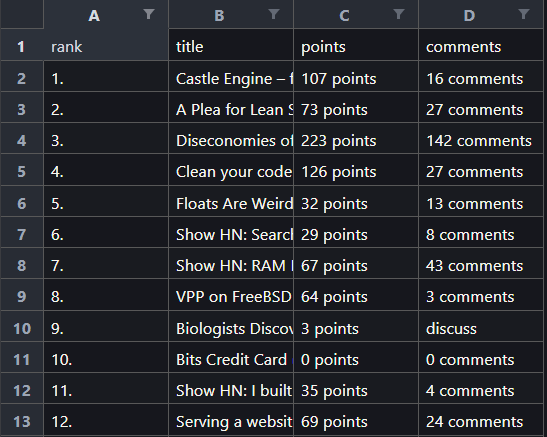

# Web Crawler

## 📘 Introduction

Using JavaScript, I have created a simple web crawler using scraping techniques to extract the first 30 entries from the website https://news.ycombinator.com/.

## 📝 Requirements

The requirements for this project are:

> [!IMPORTANT]
> The program should be able to extract the following information from the website: Title, Points, Author and Number of comments

> [!NOTE]
> For this project, I have to filter all entries with more than five words in the title ordered by the number of comments first.

> [!NOTE]
> For this project, I have to filter all entries with less than or equal five words in the title ordered by the points first.

## 💻 Technologies

- Node.js v18.7.0 or later
- JavaScript ES6

## ▶️ Setup

To run this project, install it locally using npm:

```bash
$ cd ../web-crawler
$ npm install
$ npm start https://news.ycombinator.com/
```

If you want to create an Excel file with the output, you can use the following command:

```bash
$ npm start https://news.ycombinator.com fileName
```

## 🖼️ Images

This is an example of the output console of the program:

This is an example of the output file of the program:



## 🧪 Testing

To run the tests, use the following command:

```bash
$ npm test
```

## 👨‍💻Sources

This project was created as part of a test of Software Development Intership program.
